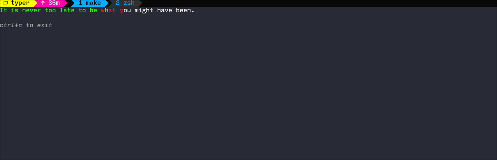

# ⌨️ Typer

[](https://golang.org/)

A simple and elegant terminal-based typing test application built with Go and the [Bubble Tea](https://github.com/charmbracelet/bubbletea) library.

## ✨ Features

- **📝 Random Quotes:** Test your typing skills with a variety of quotes from the `quotes.txt` file.
- **⏱️ WPM Calculation:** Get your words per minute (WPM) score after each test.
- **🎨 Beautiful UI:** A clean and beautiful user interface built with [Lipgloss](https://github.com/charmbracelet/lipgloss).
- **⌨️ Keyboard Shortcuts:** Use `ctrl+c` to exit the application.

## 🚀 Getting Started

To run the application, you need to have Go installed on your machine. You can then run the following commands:

```bash
# Clone the repository
git clone https://github.com/user/repo.git

# Change into the directory
cd typer

# Install dependencies
go mod tidy

# Run the application
make run
# or
make build
go run ./bin/typer
```

## 🖼️ Screenshot



## ToDo

- [ ] Add more quotes to the `quotes.txt` file.
- [ ] Add a feature to select the difficulty of the quotes.
- [ ] Add a feature to display the user's progress over time.
