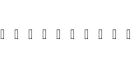

# Typer

A simple terminal-based typing test application built with Go and the Bubble Tea library.

## Description

This application reads quotes from a `quotes.txt` file and displays them to the user. The user then has to type the quote as fast as they can. The application will then calculate the user's words per minute (WPM) and display it to them.

## How to run

To run the application, you need to have Go installed on your machine. You can then run the following commands:

```bash
go get github.com/charmbracelet/bubbletea
go get github.com/charmbracelet/lipgloss
go run main.go
```

## Dependencies

- [Bubble Tea](https://github.com/charmbracelet/bubbletea)
- [Lipgloss](https://github.com/charmbracelet/lipgloss)

## Screenshot



## Contributing

Contributions are welcome! If you have any ideas on how to improve the application, feel free to open an issue or a pull request.
